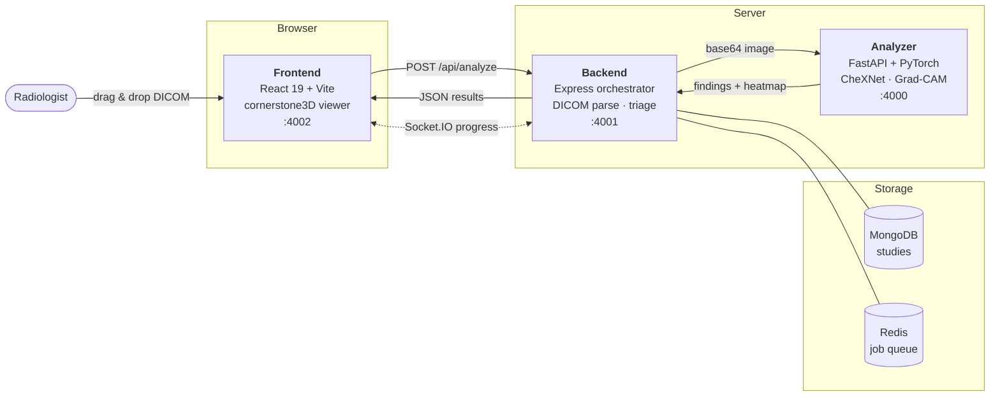

<div align="center">

# Radiology Copilot

**An open-source, AI-assisted radiology workstation.**
Drop in a DICOM study — get explainable findings, Grad-CAM heatmaps, triage priority, and a full 3D volume renderer in the browser.

[](LICENSE)
[](https://github.com/palarnab/probable-sniffle/actions/workflows/ci.yml)
[](https://nodejs.org)
[](https://python.org)
[](https://pytorch.org)
[](https://react.dev)
[](CONTRIBUTING.md)

[Quick Start](#-quick-start) · [Features](#-features) · [Architecture](#-architecture) · [API](docs/api-reference.md) · [Contributing](CONTRIBUTING.md)

</div>

> [!WARNING]
> **Research software. Not a medical device.** Radiology Copilot is **not** FDA-cleared, CE-marked, or approved by any regulatory body. It must **not** be used for clinical diagnosis, treatment decisions, or patient care. Use de-identified imaging only. See [Intended Use & Limitations](#%EF%B8%8F-intended-use--limitations).

---

## What is this?

Most radiology AI demos give you a Jupyter notebook and a probability score. Radiology Copilot gives you the whole loop a radiologist actually works in:

1. **Drop a DICOM** into a real cornerstone3D viewport with window/level, zoom, pan, and measurement tools.
2. **Get findings in seconds** — a CheXNet (DenseNet-121) model scores 14 chest pathologies.
3. **See *why*** — Grad-CAM heatmaps overlay the exact pixels that drove each prediction.
4. **Triage automatically** — findings roll up into a priority badge so urgent studies surface first.
5. **Go 3D** — upload a full CT/MR series and volume-render it in the browser.

It is built as a three-service system so the pieces stay swappable: a React workstation, a Node.js orchestrator, and a Python inference service. Replace the model without touching the UI. Replace the UI without touching the model.

---

## ✨ Features

| | Feature | Detail |
|---|---|---|
| 🩻 | **Real DICOM viewer** | cornerstone3D viewport — window/level presets, zoom, pan, length measurement, cine scroll |
| 🧠 | **14-pathology detection** | CheXNet / DenseNet-121: Atelectasis, Cardiomegaly, Effusion, Infiltration, Mass, Nodule, Pneumonia, Pneumothorax, Consolidation, Edema, Emphysema, Fibrosis, Pleural Thickening, Hernia |
| 🔥 | **Explainable by default** | Grad-CAM heatmaps rendered over the source image — no black-box scores |
| 🚦 | **Automatic triage** | Findings are scored into a priority band so critical studies bubble to the top of the worklist |
| 🧊 | **3D volume rendering** | Upload an entire CT/MR series (up to 2000 slices) and render the volume client-side |
| 📋 | **Persistent worklist** | Studies, metadata, and results stored in MongoDB with a sortable worklist table |
| ⚡ | **Live progress** | Socket.IO streams parse → inference → heatmap progress to the UI in real time |
| 🧩 | **Graceful degradation** | No GPU? Falls back to CPU. No Mongo/Redis? Runs stateless. No analyzer? Returns mock findings so the UI stays demoable |
| 🐳 | **One-command deploy** | `docker compose up` brings up all five services |

---

## 🚀 Quick Start

### Option A — Docker (recommended)

```bash
git clone https://github.com/palarnab/probable-sniffle.git
cd probable-sniffle

# Seed env files from the samples
cp .env-sample .env
cp backend/.env-sample backend/.env
cp analyzer/.env-sample analyzer/.env
cp frontend/.env-sample frontend/.env

docker compose up --build
```

Open **<http://localhost:4002>** and drag a `.dcm` file onto the upload panel.

> On Windows PowerShell, use `Copy-Item .env-sample .env` in place of `cp`.

### Option B — Run services natively

You will need three terminals.

```bash
# 1 — Analyzer (FastAPI + PyTorch)  →  http://localhost:4000
cd analyzer
python -m venv venv && source venv/bin/activate   # Windows: venv\Scripts\activate
pip install -r requirements.txt
cp .env-sample .env
python run.py
```

```bash
# 2 — Backend (Express orchestrator)  →  http://localhost:4001
cd backend
npm install
cp .env-sample .env
npm run dev
```

```bash
# 3 — Frontend (React + Vite)  →  http://localhost:4002
cd frontend
npm install
cp .env-sample .env
npm run dev
```

On first run the analyzer downloads DenseNet-121 pretrained weights into `analyzer/weights/`.

### Verify it works

```bash
curl http://localhost:4001/api/health   # backend
curl http://localhost:4000/health       # analyzer
```

Need test data? Any de-identified chest X-ray from the [NIH ChestX-ray14](https://nihcc.app.box.com/v/ChestXray-NIHCC) dataset works.

---

## 🔌 Service Map

| Service | Stack | Port | Required |
|---|---|---|---|
| Frontend | React 19, Vite 6, cornerstone3D, Tailwind v4, Zustand | `4002` | ✅ |
| Backend | Express 4, dicom-parser, Socket.IO, Mongoose, BullMQ | `4001` | ✅ |
| Analyzer | FastAPI, PyTorch, pydicom, Grad-CAM | `4000` | ✅ |
| MongoDB | Study + volume persistence | `27017` | Optional |
| Redis | BullMQ job queue | `6379` | Optional |

---

## 🏗 Architecture



**Why three services?** Deep learning belongs in Python, DICOM orchestration and I/O belong in Node, and the viewer belongs in the browser. Keeping them separate means the model can be swapped, scaled, or GPU-scheduled independently of the API. The full reasoning is in [docs/technology-decisions.md](docs/technology-decisions.md).

Deeper dives:

- [Architecture](docs/architecture.md) — component breakdown and request flow
- [Model Architecture](docs/model-architechture.md) — CheXNet, preprocessing, Grad-CAM
- [API Reference](docs/api-reference.md) — every endpoint and Socket.IO event
- [Frontend Guide](docs/frontend-guide.md) — component and state layout
- [Getting Started](docs/getting-started.md) — detailed local setup

---

## ⚕️ Intended Use & Limitations

Read this before you show it to anyone clinical.

- **Not a medical device.** No regulatory clearance of any kind. Not for diagnosis, triage of real patients, or any clinical decision.
- **Trained on a narrow domain.** CheXNet targets **frontal adult chest radiographs**. Feeding it CT slices, MR, pediatric, or lateral films produces meaningless output.
- **Known dataset bias.** ChestX-ray14 labels were NLP-mined from reports and contain substantial label noise. Reported metrics do not transfer to your population, scanner, or protocol.
- **Grad-CAM is a hint, not a segmentation.** Heatmaps indicate influential regions, not anatomical boundaries or lesion extent.
- **Use de-identified data only.** The default stack has no authentication, no audit log, and no encryption at rest. Do not put PHI in it.
- **Not HIPAA/GDPR compliant as shipped.** Deploying this against real patient data would require auth, audit trails, encryption, access control, and a compliance review.

---

## 🔐 Security

The default configuration is tuned for local development, not production. Before deploying anywhere shared:

- Set a real `JWT_SECRET` — the sample value is a placeholder.
- Enable authentication on MongoDB and Redis, and stop publishing their ports to the host.
- Put the services behind TLS and a reverse proxy.

Found a vulnerability? Please follow [SECURITY.md](SECURITY.md) — don't open a public issue.

---

## 🤝 Contributing

Contributions are genuinely welcome, especially from people who work in imaging. Good first areas:

- Additional model backends (RadImageNet, MONAI, TorchXRayVision)
- Non-chest modalities and body-part detection
- DICOM SR / FHIR ImagingStudy export
- Viewer tools — annotations, ROI statistics, MPR
- Tests (the repo has none yet — a great entry point)

Start with [CONTRIBUTING.md](CONTRIBUTING.md) and our [Code of Conduct](CODE_OF_CONDUCT.md).

---

## 🗺 Roadmap

- [ ] Test suites for all three services
- [ ] Authentication and role-based access
- [ ] DICOM SR structured report export
- [ ] DICOMweb (WADO-RS / QIDO-RS) ingestion
- [ ] Model registry — hot-swap backends without redeploy
- [ ] Multi-modality support beyond chest X-ray
- [ ] MPR and segmentation overlays in the 3D viewer

Have an idea? [Open a feature request](https://github.com/palarnab/probable-sniffle/issues/new?template=feature_request.yml).

---

## 📄 License & Credits

Released under the [MIT License](LICENSE).

Built on the shoulders of [cornerstone3D](https://github.com/cornerstonejs/cornerstone3D), [PyTorch](https://pytorch.org), [pydicom](https://pydicom.github.io), and [FastAPI](https://fastapi.tiangolo.com). The model architecture follows [CheXNet (Rajpurkar et al., 2017)](https://arxiv.org/abs/1711.05225), trained on the NIH [ChestX-ray14](https://nihcc.app.box.com/v/ChestXray-NIHCC) dataset.

Created by **[Arnab Pal](https://github.com/palarnab)** — Software Architect, Enterprise Imaging.

<div align="center">

**If this project is useful to you, a ⭐ helps other imaging folks find it.**

</div>
